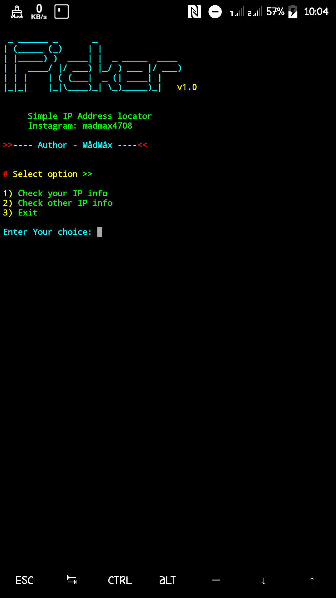

# IPicker

### A simple IP locator tool for Termux, Ubuntu and Parrot-OS

***
## [~] Installation and Usage
* $ apt-get install python3
* $ git clone https://github.com/HackWeiser360/IP-icker
* $ cd IP-icker
* $ python3 IP-icker.py
***

## Features

- Get your IP address info
- Get any website's IP Address info
- Open IP address loaction from your browser and Google Maps

## Tested On

- Ubuntu
- Parrot OS
- Termux

**For Termux users - You can open IP address loaction from browser or Google Maps App**
